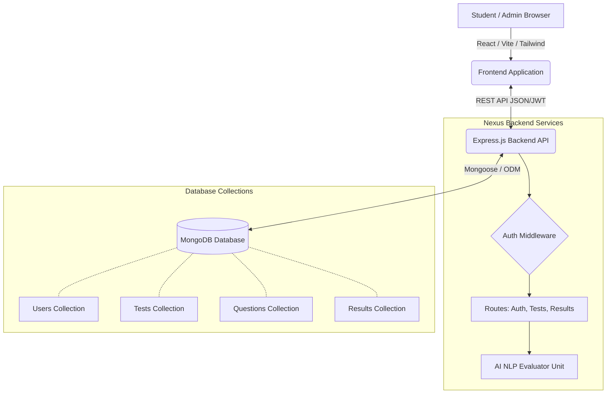
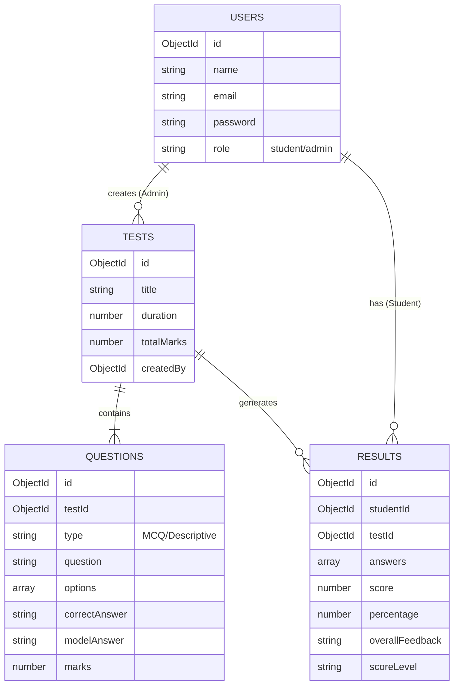

# 🎓 Nexus EduAI - AI Assessment Portal (MERN Stack)

Your AI-Powered Student Learning Depth Assessment Portal has been successfully built! This MERN stack application combines secure user management, test administration, and NLP-based evaluation into a cohesive, high-performance platform.

## 🌟 Application Architecture



## 🗄️ Database Schema 



## 🚀 How to Run the Project Locally

Because you are on Windows, please open two separate **PowerShell** or Command Prompt windows to start the environment. 

### 1. Start the Backend server

In the first terminal:
```bash
cd backend

# Install dependencies (only required the first time)
npm install

# Start the Node.js API server
npm run dev
```

### 2. Start the Frontend Application

In the second terminal:
```bash
cd frontend

# Install dependencies (only required the first time)
npm install

# Start the Vite development server
npm run dev
```

### 3. Usage Flow

1. Open your browser to the local Vite URL (usually `http://localhost:5173`).
2. Register an account as an **Admin/Teacher**.
3. Log in to the Admin workspace, create a test, and add descriptive and MCQ questions. Set a robust "Model Answer" for the AI to base its evaluation on.
4. Log out, then register a **Student** account.
5. Log in, take the assessment, write your descriptive answers, and hit Submit!
6. Instantly view your score, analytical pie charts, concept level, and AI-generated NLP feedback!

## 💡 Recommended Future Upgrades
- Connect the `utils/aiEvaluator.js` to the **OpenAI API** for state-of-the-art semantic evaluation.
- Integrate WebRTC to enable the "Proctoring/Cheating Detection" feature.
